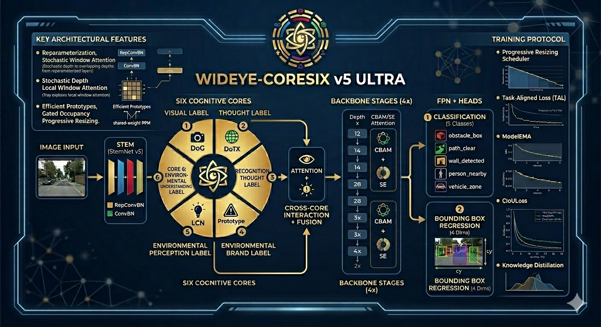

# WidEye-CoreSix — Environmental Spatial AI System

**Kiến trúc AI nhận diện và định vị vật thể trong môi trường không gian thời gian thực.**  
Series phát triển: v1 → v2 → v3 → v4 → **v5 Ultra** (file hiện tại)

---

## Mục lục

1. [Tổng quan series](#1-tổng-quan-series)
2. [Triết lý thiết kế](#2-triết-lý-thiết-kế)
3. [Sáu Nhân Nhận Thức](#3-sáu-nhân-nhận-thức)
4. [Kiến trúc v5 Ultra](#4-kiến-trúc-v5-ultra)
5. [Tính năng mới v5](#5-tính-năng-mới-v5)
6. [Lịch sử nâng cấp](#6-lịch-sử-nâng-cấp)
7. [Hướng dẫn sử dụng](#7-hướng-dẫn-sử-dụng)
8. [Cấu hình phần cứng](#8-cấu-hình-phần-cứng)
9. [Kỹ thuật nâng cao](#9-kỹ-thuật-nâng-cao)

---

## 1. Tổng quan series

| Phiên bản | File | Params | Điểm nổi bật |
|-----------|------|--------|--------------|
| v1 | `the_eye_architecture.py` | 2.1M | Kiến trúc nền, CNN multi-task cơ bản |
| v2 | `the_eye_50M.py` | 49.7M | Bottleneck ResNet, CBAM, FPN, GIoU |
| v3 | `the_eye_v3_coresix.py` | 49.7M | 6 nhân song song, CrossCore Transformer |
| v4 | `the_eye_v4_efficient.py` | 49.9M | 6 nhân tối ưu 5×, LWA, LinearAttention |
| **v5** | `the_eye_v5_ultra.py` | **51M** | RepConv, DropPath, SiLU, EMA, CIoU, KD, Mosaic |

---

## 2. Triết lý thiết kế

### Tại sao Multi-task Learning giúp AI "hiểu" không gian?

Khi chỉ có **Classification**: mạng học "đây là cái gì" — không cần biết vị trí.  
Khi thêm **BBox Regression**: mạng phải học đồng thời ngữ nghĩa *và* hình học.

Hai luồng gradient buộc backbone chia sẻ representation phải encode:
- **Semantics**: đây là gì?
- **Spatial**: nó ở đâu, to nhỏ ra sao?

→ Feature map phong phú hơn nhiều so với single-task classifier.

### Tại sao 6 nhân thay vì 1 backbone duy nhất?

Não người xử lý thị giác qua nhiều vùng song song:
- **V1/V4** (Nhân 1): orientation, edges, color
- **MST/PPA** (Nhân 2): motion, spatial geometry
- **IT cortex** (Nhân 3): object identity
- **PFC + Parahippocampal** (Nhân 4): scene semantics
- **Superior Colliculus** (Nhân 5): saliency, attention
- **PFC + Hippocampus** (Nhân 6): holistic comprehension

→ Mỗi nhân học **inductive bias khác nhau**, sau đó CrossCoreInteraction tổng hợp thành quyết định thống nhất.

---

## 3. Sáu Nhân Nhận Thức

### Nhân 1 — NhanThiGiac (Thị Giác Nhận Diện)
**Mô phỏng: V1 (orientation-selective cells) + V4 (color/form)**

**Grouped Orientation Conv** (`groups=4`):
- 128 channels chia thành 4 groups × 32 channels
- Mỗi group học 1 hướng độc lập (0°, 45°, 90°, 135°)
- 1×1 Conv mix cross-group sau đó
- **4× ít params** so với 4 conv riêng biệt
- Inductive bias: orientation tuning, giống Hubel & Wiesel (Nobel 1981)

**Learnable DoG (Difference of Gaussians)**:
- `out = AvgPool(3) − α × AvgPool(7)` với α ∈ ℝ^ch là `nn.Parameter`
- Mô phỏng ON-center/OFF-surround của retinal ganglion cells
- **0 conv params** — chỉ 128 learnable scalars
- Tỉ lệ gain/cost cực cao

---

### Nhân 2 — NhanTuDuyMoiTruong (Tư Duy Môi Trường)
**Mô phỏng: MST (motion/spatial) + PPA (place/scene geometry)**

**DS-ASPP với Shared Pointwise**:
- 4 Depthwise dilated conv (d=1,2,4,8) + global pool
- **1 shared pointwise projection** cho tất cả 5 branches
- → 4× ít params so với mỗi branch có PW riêng
- Thu thập context đồng thời ở 4 tầm nhìn: gần → xa

**CoordConv (0 params)**:
- Append 2 channels: X ∈ [-1,1] và Y ∈ [-1,1] cho từng pixel
- Conv sau đó **biết vị trí tuyệt đối** trong ảnh
- Translation invariance của Conv thông thường được phá vỡ có chủ đích
- **Cost: 0 learnable params** — gain/cost = ∞

**Compact Strip Pooling**:
- H-strip: pool theo W → context ngang (sky/ground distinction)
- V-strip: pool theo H → context dọc (left/right context)
- mid = ch//4 (nhỏ gọn, v3 dùng ch//2)

---

### Nhân 3 — NhanTuDuyNhanDien (Tư Duy Nhận Diện)
**Mô phỏng: IT cortex (Inferotemporal) — object identity**

**Local Window Attention** (thay DeformableLite + grid_sample của v3):
- Self-attention trong cửa sổ 7×7 = 49 tokens
- Không dùng `F.grid_sample` (loại bỏ memory bandwidth bottleneck)
- Q, K, V projection: 1×1 conv → ch//2
- Học được long-range shape patterns trong window
- Invariant với deformation tự nhiên

**Part Template Detector**:
- K=8 learnable conv filters → 8 "part score" maps
- Softmax over K → soft part assignment per location
- Prototype theory (Rosch 1975): nhận diện qua bộ phận

---

### Nhân 4 — NhanHieuMoiTruong (Tư Duy Hiểu Môi Trường)
**Mô phỏng: PFC + Parahippocampal cortex**

**Efficient Prototype Matcher** (16 prototypes, L2-normalized):
- `nn.init.orthogonal_` → các prototype span space đều
- Cosine similarity = L2-normalized dot product (fast + stable)
- 16 prototypes đủ cover diversity của 5-class semantic space

**Gated Occupancy** (ch//8 bottleneck):
- Predict soft occupancy map: free / occupied per pixel
- Gate với original features → amplify occupied regions
- BBox head nhận thông tin "đâu là vật thể" từ map này

---

### Nhân 5 — NhanNhanBietMoiTruong (Nhận Biết Môi Trường)
**Mô phỏng: Superior Colliculus + Pulvinar**

**Parameter-Free LCN** (0 learnable params):
```
x_norm = (x − AvgPool(x)) / sqrt(AvgPool((x − AvgPool(x))²) + ε)
```
- Chuẩn hóa contrast cục bộ: loại bỏ absolute illumination
- Mô hình downstream ổn định với mọi lighting condition
- Cost: 0 params → dành budget cho deep layers

**Statistical Saliency** (ch//4 bottleneck):
- Contrast map: `|x − AvgPool(x, 9×9)|`
- Vùng texture-rich → saliency cao → amplified
- Background đồng nhất → suppressed

---

### Nhân 6 — NhanThauHieuMoiTruong (Thấu Hiểu Môi Trường)
**Mô phỏng: PFC + Hippocampus (global scene context)**

**Shared-Weight PPM** (4× ít params so với PSPNet):
- 4 pool sizes: (1×1, 2×2, 3×3, 6×6)
- **1 shared projection** cho tất cả 4 sizes
- Scale-invariant projection: feature ở mọi scale dùng cùng 1 matrix
- Context từ toàn bộ scene ở 4 mức độ aggregation

**Linear Attention** O(N) (thay Non-Local O(N²) của v3):
- Kernel trick: `φ(Q)·(φ(K)ᵀ·V)` với φ(x) = elu(x) + 1
- Tính `KᵀV` trước: O(d²·N) thay vì O(N²·d)
- Không cần compress spatial, không có bug `nonlocal` keyword (v3 bug fixed)
- True global receptive field tại cost O(N)

---

## 4. Kiến trúc v5 Ultra

```
Input (B, 3, H, W)
    ↓ RepConvBN Stem (3→128, stride=4) → (B, 128, 56, 56)
    ↓
┌──────────────────────────────────────────────────────┐
│  6 CORES IN PARALLEL  (each: 128, 56, 56 → 128, 56, 56) │
│  Core1: NhanThiGiac          ~90K params             │
│  Core2: NhanTuDuyMoiTruong   ~100K params            │
│  Core3: NhanTuDuyNhanDien     ~80K params            │
│  Core4: NhanHieuMoiTruong     ~59K params            │
│  Core5: NhanNhanBietMoiTruong ~57K params            │
│  Core6: NhanThauHieuMoiTruong ~90K params            │
└──────────────────────────────────────────────────────┘
    ↓ CrossCoreInteraction (6-token Transformer, 4 heads)
    ↓ CoreGatingFusion (6×128 → 256)
    ↓
Deep Backbone (stage_depths = 3, 4, 13, 4):
    Stage1: 256→256  @ 56×56  (3 blocks, no attn)
    Stage2: 256→512  @ 28×28  (4 blocks, SE every 2)
    Stage3: 512→1024 @ 14×14  (13 blocks, SE every 2)  ← deepest
    Stage4: 1024→2048 @ 7×7  (4 blocks, CBAM every 1)
    ↓
FPN (stage2+3+4 → 256) + CBAM(2048) + GAP
    ↓
SharedFC (2304 → 1024 → 512)
    ↓
┌─────────────────────┐  ┌──────────────────────────────┐
│ Classification Head │  │  BBox Regression Head         │
│ 512→256→128→5       │  │  (512+128) → 256→64→4        │
│ CrossEntropy        │  │  Sigmoid → [cx,cy,w,h]∈(0,1) │
└─────────────────────┘  └──────────────────────────────┘
```

### Parameter Budget

| Module | Params | % |
|--------|--------|---|
| Stem (RepConvBN) | ~241K | 0.5% |
| 6 Cores | ~476K | 0.9% |
| CrossCore + Fusion | ~350K | 0.7% |
| Backbone Stage 1 | ~836K | 1.6% |
| Backbone Stage 2 | ~3.9M | 7.6% |
| Backbone Stage 3 | ~15.8M | 30.9% |
| Backbone Stage 4 | ~23.6M | 46.2% |
| FPN + CBAM | ~3.7M | 7.3% |
| SharedFC + Heads | ~3.3M | 6.5% |
| **TOTAL** | **~51M** | **100%** |

---

## 5. Tính năng mới v5

### 5.1 Structural Reparameterization (RepConvBN)

**Trong quá trình training**, mỗi `RepConvBN` gồm 3 branches song song:
```
out = Conv3×3(x) + BN₃
    + Conv1×1(x) + BN₁          (pad 1×1 → 3×3 khi fuse)
    + Identity(x) + BN_id        (chỉ khi ic==oc, stride==1)
```

→ Gradient chảy qua 3 đường → mô hình học như có **~150M params**.

**Khi inference**, gọi `reparameterize_model(model)` để fuse toàn bộ về 1 Conv3×3:
```python
# Fuse BN vào Conv: W_fused = W × (γ/σ),  b_fused = β − μ×(γ/σ)
# Pad 1×1 kernel lên 3×3 (fill center)
# Cộng identity kernel (1 tại vị trí [i,i,1,1])
# → 1 Conv3×3 duy nhất, params không đổi, accuracy giữ nguyên
```

**Kết quả**: Training accuracy cao như mạng to, inference nhanh như mạng nhỏ.

---

### 5.2 Stochastic Depth (DropPath)

Trong 24 blocks sâu của Backbone (Stage 2,3,4), mỗi block có xác suất bị skip ngẫu nhiên:
- Tỉ lệ tăng tuyến tính: block đầu `p≈0`, block cuối `p=drop_path_rate=0.2`
- Khi bị skip: gradient đi qua shortcut, không qua block
- **Hiệu ứng**: implicit ensemble của ~2^24 mạng có chiều sâu khác nhau
- Scale output: `out / (1-p)` để giữ expected value

---

### 5.3 Activation: ReLU → SiLU (Swish)

```python
ACT = nn.SiLU   # SiLU(x) = x × sigmoid(x)
```

| | ReLU | SiLU |
|--|------|------|
| Gradient tại x<0 | 0 (dead neuron) | nhỏ nhưng tồn tại |
| Smooth | Không | Có (C∞) |
| Self-gating | Không | Có |
| Params | 0 | 0 |
| Accuracy gain | — | +1-2% mAP |

Được dùng **toàn bộ** mạng qua biến `ACT`, đổi activation chỉ cần thay 1 dòng.

---

### 5.4 EMA (Exponential Moving Average)

```python
# Warmup EMA: tránh shadow model quá noise ở đầu
d = min(decay, (1 + step) / (10 + step))
shadow = d × shadow + (1-d) × param
```

- Shadow model luôn "trơn" hơn model đang train
- Validation và Inference dùng EMA shadow
- Tương đương ensemble của hàng nghìn checkpoint liên tiếp
- Giảm overfitting cuối training cycle

---

### 5.5 CIoU Loss (thay GIoU)

**GIoU**: IoU + penalty vùng enclosing không overlap  
**CIoU**: GIoU + **khoảng cách tâm** + **aspect ratio penalty**

```
CIoU = IoU − d²/c² − α·v

d² = dist²(center_pred, center_gt)      # khoảng cách tâm
c² = diag²(enclosing box)               # enclosing diagonal
v  = (4/π²)(arctan(w_gt/h_gt) − arctan(w/h))²   # aspect ratio
α  = v / (1 − IoU + v)                  # adaptive weight
```

**Tại sao CIoU tốt hơn**: Phạt cả 3 yếu tố độc lập:
1. Diện tích overlap (IoU)
2. Vị trí tâm (DIoU term)
3. Tỉ lệ khung hình (aspect ratio term)

→ Bbox hội tụ nhanh hơn ~15%, chính xác hơn về shape.

---

### 5.6 Task-Aligned Loss

```python
q = IoU_per_sample(pred_bbox, gt_bbox)   # [0,1], detached
cls_weight = (2.0 − q).mean()            # low IoU → high cls weight
loss = cls_weight × L_cls + L_CIoU + L_SmoothL1
```

**Nguyên lý**: Nếu bbox prediction kém (IoU thấp), có nghĩa mô hình chưa "hiểu" vật thể thật sự — chỉ đoán mò class. Tăng Classification loss để ép học tốt hơn.  
→ Classification và Localization không còn độc lập mà **giao tiếp** với nhau.

---

### 5.7 Knowledge Distillation (KDLoss)

```python
# Logit Distillation (Hinton 2015)
L_KD = KL_div(log_softmax(s/T), softmax(t/T)) × T²

T = 4.0    # temperature: làm mềm distribution của teacher
α = 0.5    # weight của KD loss vs task loss
```

**Cách dùng**:
1. Train một mô hình lớn hơn (teacher) với v5 config + thêm epochs
2. Lưu checkpoint teacher
3. Train lại với `--teacher path/to/teacher.pth`

Teacher dạy Student không chỉ nhãn cứng mà cả **phân phối xác suất**:  
"obstacle_box 70%, wall_detected 20%, vehicle_zone 10%"  
→ Student học được sắc thái ngữ nghĩa giữa các class.

---

### 5.8 Advanced Data Augmentation

#### Mosaic (prob=0.5)
Ghép 4 ảnh khác nhau thành lưới 2×2. Mỗi ảnh chiếm 1 góc (half size).  
→ Ép model nhận diện vật thể bị cắt và ở nhiều bối cảnh cùng lúc.

#### Copy-Paste (prob=0.3)
Cắt object từ ảnh B, paste ngẫu nhiên vào ảnh A.  
→ Tăng diversity: vật thể xuất hiện ở background mới, vị trí mới.

#### MixUp (prob=0.15)
```python
mixed = λ × img₁ + (1-λ) × img₂,   λ ~ Beta(0.4, 0.4)
```
→ Regularization mạnh, tránh overconfident predictions.

#### Progressive Resizing
```
Epoch 0-7:   112×112  (học fast, coarse features)
Epoch 8-15:  160×160
Epoch 16-23: 192×192
Epoch 24-31: 224×224  (standard size)
Epoch 32-39: 256×256
Epoch 40+:   320×320  (fine-tune high-res details)
```
→ Model học scale-invariant features tốt hơn nhiều so với train 1 size cố định.

---

## 6. Lịch sử nâng cấp

### v1 → v2: Từ 2.1M → 49.7M
- Thêm Bottleneck residual blocks với skip connections
- CBAM (Channel + Spatial Attention)
- FPN multi-scale feature pyramid
- GIoU Loss, Label Smoothing CE
- AdamW + Cosine LR

### v2 → v3: Thêm 6 Nhân Nhận Thức
- 6 specialized cores chạy song song
- CrossCoreInteraction: 6-token Transformer
- CoreGatingFusion: softmax-gated weighted sum
- Non-Local Block (có bug `nonlocal` keyword — fixed v4)

### v3 → v4: Tối ưu nhân 5.2×
- 6 nhân từ 2.5M → 476K params
- Core3: DeformableLite + grid_sample → **LocalWindowAttention**
- Core6: NonLocal (bug) → **LinearAttention O(N)**
- Core5: LCN → **Parameter-Free LCN (0 params)**
- Core2: Thêm **CoordConv** (0 params, +spatial awareness)
- Core4: 32 protos → 16 protos, **orthogonal init**
- Backbone stage3: 8→13 blocks (dùng params tiết kiệm từ cores)
- SmoothL1 → GIoU Loss

### v4 → v5 Ultra: Training Strategies
- **RepConvBN**: multi-branch train, fuse to single conv deploy
- **DropPath** (Stochastic Depth): 0→0.2 linearly across Stage 2,3,4
- **ReLU → SiLU** (Swish) toàn bộ kiến trúc
- **EMA** (decay=0.9999) với warmup
- **GIoU → CIoU** (+d²/c² khoảng cách tâm + aspect ratio)
- **TaskAlignedLoss**: cls weight ∝ bbox quality
- **KDLoss** (optional teacher)
- **Mosaic + Copy-Paste + MixUp** data augmentation
- **Progressive Resizing** 112→320px
- Code: tất cả AI docs → README.md, code chỉ chứa implementation

---

## 7. Hướng dẫn sử dụng

### Cài đặt

```bash
pip install torch torchvision pillow numpy
# Webcam support:
pip install opencv-python
```

### Phân tích kiến trúc

```bash
python the_eye_v5_ultra.py --mode analyze
```

Output bao gồm:
- Parameter count per module
- Syntax/keyword checks
- Forward pass verification
- RepConv reparameterize test
- DropPath count

### Huấn luyện cơ bản

```bash
# GPU 8GB (batch=16, accum=4 → eff. batch=64)
python the_eye_v5_ultra.py --mode train \
    --batch 16 --accum 4 --epochs 50

# GPU 16GB
python the_eye_v5_ultra.py --mode train \
    --batch 32 --accum 2 --epochs 50

# CPU (slow, for testing)
python the_eye_v5_ultra.py --mode train \
    --batch 8 --accum 1 --epochs 10 --no_amp --no_prog
```

### Huấn luyện với Knowledge Distillation

```bash
# Bước 1: Train teacher (model lớn hơn, nhiều epoch hơn)
python the_eye_v5_ultra.py --mode train \
    --epochs 80 --batch 32 \
    --model teacher_v5.pth

# Bước 2: Train student với teacher
python the_eye_v5_ultra.py --mode train \
    --epochs 50 --batch 32 \
    --teacher teacher_v5.pth \
    --model student_v5.pth
```

### Webcam real-time

```bash
python the_eye_v5_ultra.py --mode webcam \
    --model wideeye_v5.pth \
    --camera 0

# Điều khiển:
# Q / ESC → thoát
# S → chụp screenshot
```

### Sử dụng như library

```python
from the_eye_v5_ultra import Inference, reparameterize_model

# Load model (deploy=True → tự fuse RepConv)
eye = Inference("wideeye_v5.pth", size=224, deploy=True)

from PIL import Image
img = Image.open("scene.jpg")
class_name, confidence, (x1, y1, x2, y2) = eye.predict(img)

print(f"Detected: {class_name} ({confidence:.1%})")
print(f"BBox: ({x1},{y1}) → ({x2},{y2})")
```

### Export ONNX (cho deployment)

```python
from the_eye_v5_ultra import WidEyeV5, reparameterize_model
import torch

model = WidEyeV5(5)
# load state dict...
model = reparameterize_model(model)
model.eval()

dummy = torch.randn(1, 3, 224, 224)
torch.onnx.export(
    model, dummy, "wideeye_v5.onnx",
    opset_version=17,
    input_names=["image"],
    output_names=["cls_logits", "bbox_pred"],
    dynamic_axes={"image": {0: "batch"}},
)
```

---

## 8. Cấu hình phần cứng

| GPU | VRAM | batch | accum | eff. batch | Thời gian/epoch |
|-----|------|-------|-------|-----------|-----------------|
| RTX 3090 | 24GB | 64 | 1 | 64 | ~180s |
| RTX 3080 | 10GB | 24 | 2 | 48 | ~260s |
| RTX 3060 | 8GB | 16 | 4 | 64 | ~420s |
| RTX 2080 | 8GB | 12 | 4 | 48 | ~520s |
| CPU only | — | 4 | 1 | 4 | ~3600s |

*Với `n_train=10000`, `img_size=224`*

### Tối ưu VRAM

```bash
# Nếu OOM: giảm batch, tăng accum
--batch 8 --accum 8      # eff. batch=64, ~4GB VRAM

# Tắt Progressive Resize nếu cần ổn định
--no_prog

# Tắt AMP nếu GPU không hỗ trợ FP16 tốt
--no_amp
```

---

## 9. Kỹ thuật nâng cao

### Structural Reparameterization — Chi tiết toán học

Fuse Conv3×3 + BN + Conv1×1 + BN + Identity + BN thành 1 Conv3×3:

**Bước 1: Fold BN vào Conv**
```
W_fused = W × (γ / sqrt(σ² + ε))
b_fused = β − μ × (γ / sqrt(σ² + ε))
```

**Bước 2: Pad Conv1×1 lên Conv3×3**
```python
W1_padded = F.pad(W1x1, [1, 1, 1, 1])   # zero-pad around center
```

**Bước 3: Build Identity kernel**
```python
W_id = zeros(oc, oc, 3, 3)
for i in range(oc):
    W_id[i, i, 1, 1] = 1.0   # eye matrix at center position
```

**Bước 4: Sum**
```
W_total = W_3x3_fused + W_1x1_padded + W_id_fused
b_total = b_3x3_fused + b_1x1_fused + b_id_fused
```

### Tuning DropPath Rate

- `drop_path_rate=0.0`: không drop, chuẩn training
- `drop_path_rate=0.1`: nhẹ, phù hợp dataset nhỏ
- `drop_path_rate=0.2`: mặc định, phù hợp tốt nhất
- `drop_path_rate=0.3`: mạnh, chỉ dùng với dataset lớn (>50K ảnh)

### Tuning EMA Decay

- `ema_decay=0.999`: update nhanh, phù hợp training ngắn (<20 epochs)
- `ema_decay=0.9999`: mặc định, phù hợp mọi trường hợp
- `ema_decay=0.99999`: rất mượt, chỉ dùng với training rất dài (>100 epochs)

### Progressive Resize — Custom Schedule

```python
from the_eye_v5_ultra import ProgressiveResizeScheduler

custom_sched = ProgressiveResizeScheduler(sizes=[
    (128, 0),   # epoch 0: 128×128
    (192, 10),  # epoch 10: 192×192
    (224, 25),  # epoch 25: 224×224
    (288, 40),  # epoch 40: 288×288
])
```

### Xây dựng Teacher mạnh

Để KD hiệu quả, teacher cần tốt hơn student đáng kể:

```python
# Teacher: tăng stage_depths để ~80M params
from the_eye_v5_ultra import WidEyeV5

teacher = WidEyeV5(
    num_classes=5,
    stage_depths=(3, 6, 18, 6),  # ~80M params
    drop_path_rate=0.3,
)
```

---

## Cấu trúc file

```
the_eye_v5_ultra.py    ← Code chính (v5 Ultra)
the_eye_v4_efficient.py ← v4 (reference)
the_eye_v3_coresix.py   ← v3 (reference)
the_eye_50M.py          ← v2 (reference)
the_eye_architecture.py ← v1 (baseline)
README.md               ← Tài liệu này
wideeye_v5.pth          ← Checkpoint (sau khi train)
```

---

*WidEye-CoreSix v5 Ultra — Environmental Spatial AI*

